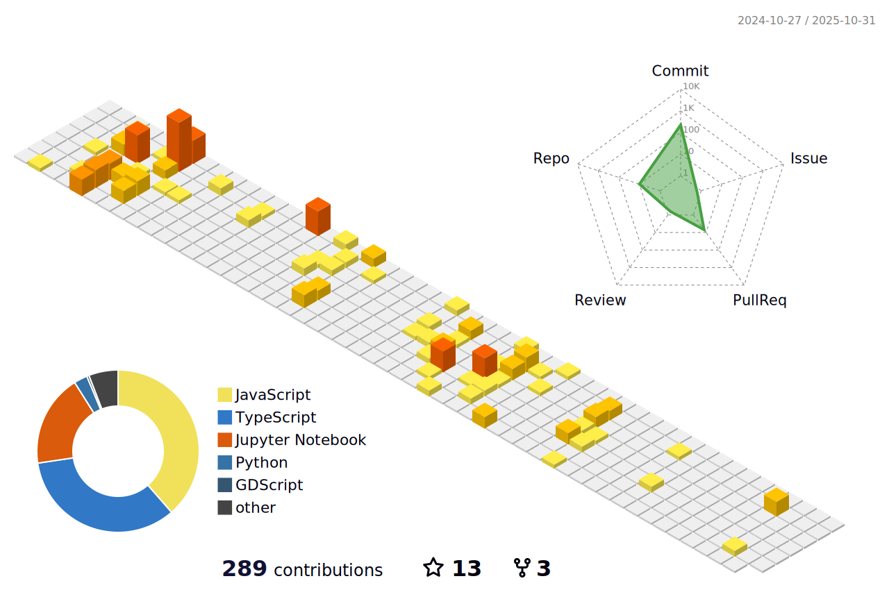

<h1 align="center">Hi, I'm Plan Ghimire 👋</h1>
<h3 align="center">🎓 Electronics Communication and Information Engineering Student | 💻 Developer | 🎨 Designer</h3>

  
  
  

---

## 🧑‍💻 About Me

- 🔭 Currently pursuing **Electronics Communication and Information Engineering** at **IOE Thapathali Campus**.
- 🌐 Passionate about integrating technology with creativity.
- 📝 Regularly writing articles on [blog.plan.com.np](https://blog.plan.com.np/).
- 💬 Ask me about **Machine Learning, Python, C/C++, React.js**.
- 📫 Reach me at **contact@plan.com.np**.

---

## 🔗 Connect with Me

  
  
  
  

---

## 🛠️ Languages and Tools

  
  
  
  
  
  
  
  
  
  
  

---

## 🖼️ 3D Contribution Graph

---
## 📊 GitHub Stats

  
  

---

## 📈 Top Languages

  

---

---
